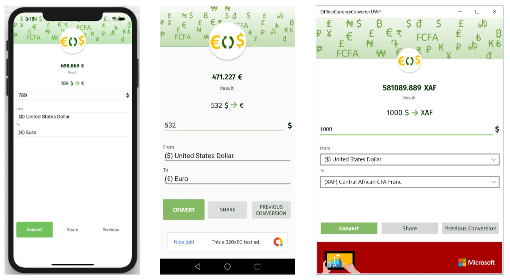

# Offline Currency Converter

This is a simple currency converter, writen in Xamarin Forms which demonstrate the usage of several important features of Xamarin.Forms which real world production applications have. These features include:

- Responsive layout Styled with XAML

- Ads

- Offline Data Sync

- Rest API consumption

- Adding Appcenter Analytics and Crash Report

- Multillingual

- Custom Renderers

- MVVM with ReactiveUI
  
  

# Author

Damien Doumer ["At Cool Coders"](https://doumer.me)